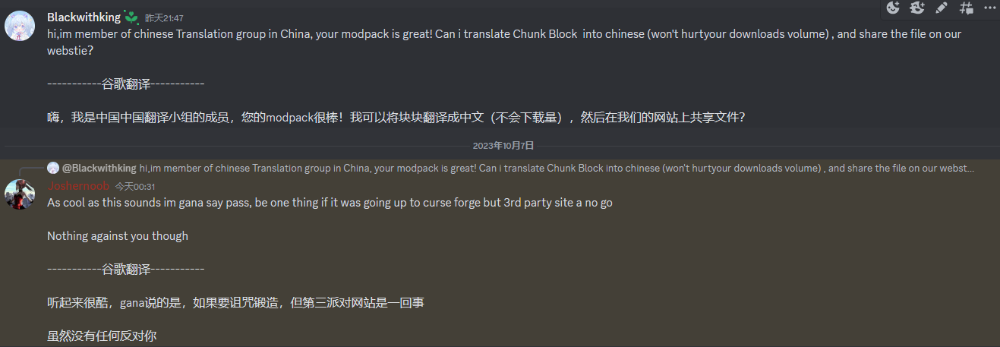

 
    
   <h1>Chunk Block简体中文翻译</h1>

CurseForge|加载器|整合包版本|状态
:-|:-|:-|:-
[链接](https://www.curseforge.com/minecraft/modpacks/chunk-block)|Forge|mc1.19.2 0.0.6|*维护中*|

---

汉化项目：[Paratranz](https://paratranz.cn/projects/11916)

汉化发布：[VM汉化组官网](https://vmct-cn.top/modpacks/chunk)

项目主管 @[Wulian233](https://github.com/Wulian233)

译者：[查看贡献者排行榜](https://paratranz.cn/projects/11916/leaderboard)、Sine

特殊注明：
    对于resourcepacks/VM汉化补丁/assets/material_elements/lang/zh_cn.json
    汉化来自CFPA的未合并PR。按照协议规定使用CC BY-NC-SA 4.0，而非VM汉化组的ARR协议。
    原文请见：<https://github.com/CFPAOrg/Minecraft-Mod-Language-Package/blob/main/LICENSE>
    原PR：<https://github.com/CFPAOrg/Minecraft-Mod-Language-Package/pull/4165>

## 整合包介绍

这是一款为非专家设计的整个包，游戏开始时你会处于一个16x16方块的区块中，周围是一片虚空！在这个整合包中，你唯一的目标是重建你失去的世界，并在过程中享受乐趣！

这个整合包主要集中在世界生成相关的模组，意味着你会看到很多魔法类的大型模组，不过我也加入了一些大家熟悉的科技模组，帮助你更好地推进游戏。

即使你是新玩家，下载后也会觉得很容易上手，这是因为任务系统的帮助！所有从小型到大型的模组都被合理地编排，任何人都能轻松跟随并游玩这些模组！

### 特色

- 非专家向的游戏玩法

- 第一个使用单区块而非岛屿的整合包！

- 没有无中生有模组！

- 按步骤进行的任务书，满足你的所有需求！

- 即使有所有世界生成模组，运行起来也小巧且流畅！
